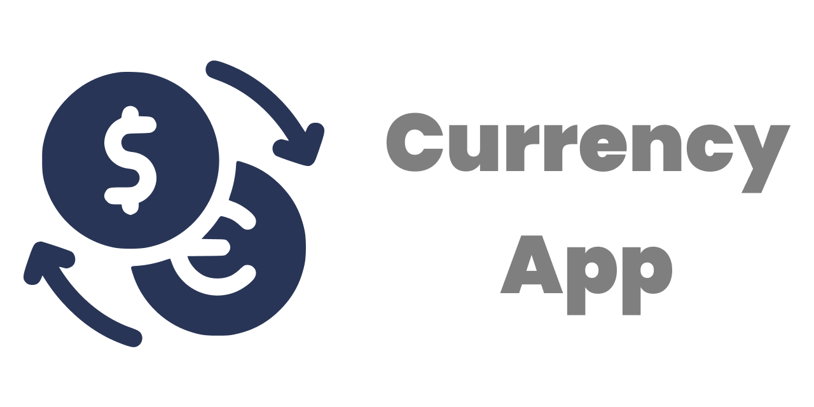
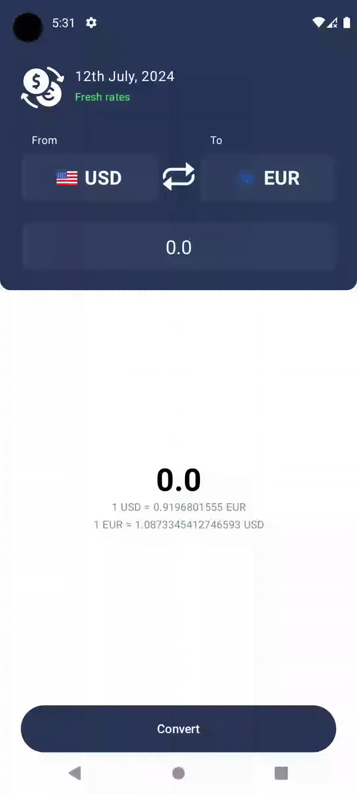
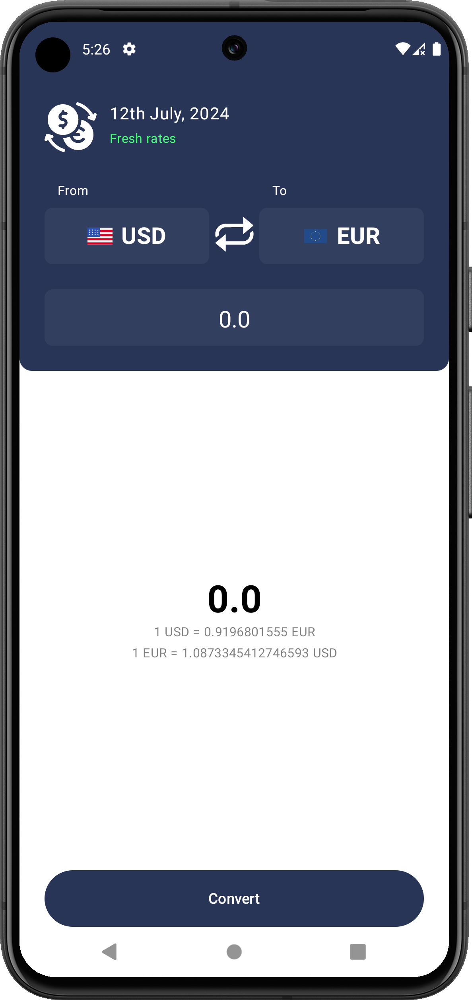
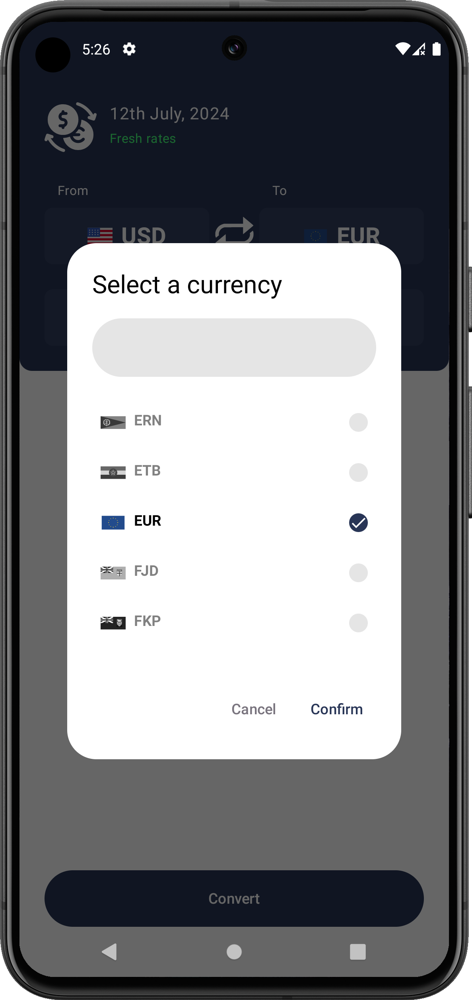
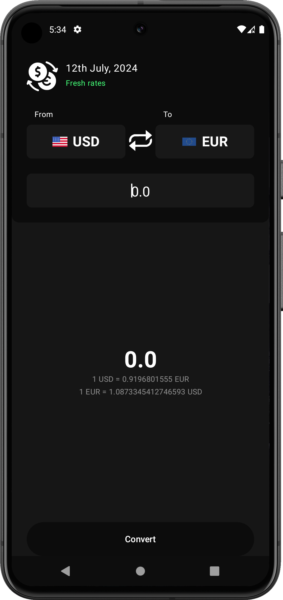
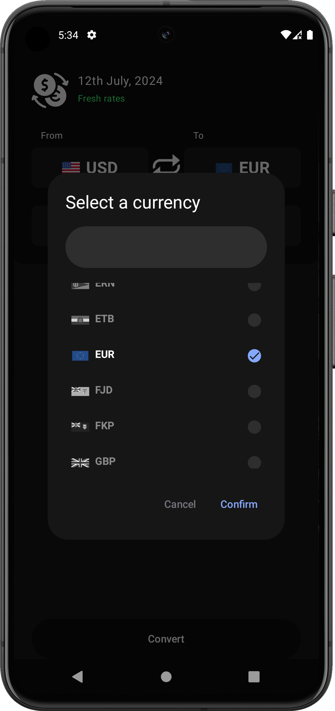

# CurrencyApp💱

-000000?style=for-the-badge&logo=ios&logoColor=white)

## Table of Contents

- [Introduction](#introduction)
- [Preview](#preview)
- [Technologies Used](#technologies-used)
- [Installation](#installation)
- [Incoming Features](#incoming-features)
- [Contributing](#contributing)
- [License](#license)

## Introduction
- This currency app is designed to simplify your financial travels and transactions. Whether you're planning an international trip, managing currencies, or just curious about exchange rates.

## Preview

  
  
  
  
  

## Technologies Used
- [Kotlin Multiplatform](https://kotlinlang.org/docs/multiplatform.html)
- [Jetpack Compose](https://developer.android.com/develop/ui/compose)
- [Koin (Dependency Injection)](https://insert-koin.io)
- [Atlas Device SDK (Store/Cache data)](https://www.mongodb.com/docs/atlas/device-sdks/sdk/kotlin/)
- [Coroutines](https://kotlinlang.org/docs/coroutines-overview.html)
- [Currency API](https://currencyapi.com)

## Installation
1. Clone this repository `git clone https://github.com/GuilhermeIgnacio/CurrencyApp`
2. Open this project in Android Studio
3. Build and run the application on your Android device or emulator

### Or:

- Download the APK from my [Portfolio](https://guilhermeignacio.vercel.app) clicking [here](https://guilhermeignacio.vercel.app/projects/currencyApp/composeApp-release.apk).
- You can find this APK on this repository [here](composeApp/release/composeApp-release.apk)

### Setting your own key:
1. Go to [composeApp/src/commonMain/kotlin/data/remote/api/CurrencyApiServiceImpl.kt](composeApp/src/commonMain/kotlin/data/remote/api/CurrencyApiServiceImpl.kt)
2. Change the `const val API_KEY` values

## Incoming Features
- IOS Version

## Contributing
Contributions are what make the open-source community such an amazing place to learn, inspire, and create. Any contributions you make are **greatly appreciated**.

1. **Fork the Project**
2. **Create your Feature Branch** (`git checkout -b feature/AmazingFeature`)
3. **Commit your Changes** (`git commit -m 'Add some AmazingFeature'`)
4. **Push to the Branch** (`git push origin feature/AmazingFeature`)
5. **Open a Pull Request**

## License
Distributed under the MIT License.

---